# AutoTend - Automatic Attendance System

## 🚀 Installation

1. Clone the repository and in the project directory run:
   ```bash
   cd AutoTend
   ```

2. Create and activate a virtual environment (A working installation of python3.11 is required on target machine):
   ```bash
   python3.11 -m venv venv
   source venv/bin/activate
   ```

3. Install dependencies:
   ```bash
   pip install -r requirements.txt
   ```

4. Run the server using your machine’s **IPv4 address** (not `127.0.0.1` or `localhost`):
   ```bash
   python manage.py runserver <your-ipv4-address>:<port>
   ```

> ⚠️ **Note**: To get your IPv4 address in Python:
   ```python
   import socket
   s = socket.socket(socket.AF_INET, socket.SOCK_DGRAM)
   s.connect(("8.8.8.8", 80))
   print(s.getsockname()[0])
   s.close()
   ```

## Model Evaluation

We conducted two experiments to evaluate the performance of different face detection models and to assess whether intra-lecture clustering improves identification accuracy.

### Experiment 1: Identifying the Best Face Detection Model and Optimal Thresholds

**Methodology**:  
We compared three face detection models: **Buffalo L**, **Buffalo Sc**, and **Antelope v2**. Each model was evaluated by computing the average F1 score across all pre-midsem lecture recordings. The experiment was conducted over various combinations of face detection and face similarity thresholds.  
- *Face detection threshold* refers to the confidence score for whether a detected bounding box actually contains a face.  
- *Similarity threshold* refers to the cosine similarity score between two face embeddings; it determines whether two faces are considered a match.

**Pipeline Architecture**:  
For each lecture, a model was run on the faces detected from all photos. For every detected face, we computed the cosine similarity against all ground truth embeddings. If the highest similarity score for any ground truth face exceeded the specified threshold, that student was marked as present.

Below are the F1 score heatmaps for all three models:

#### Buffalo L
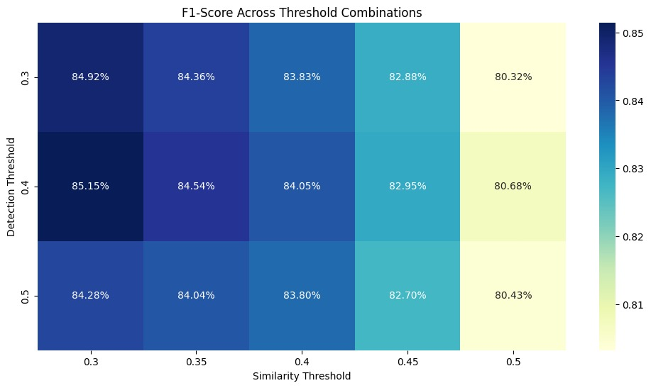

#### Buffalo Sc
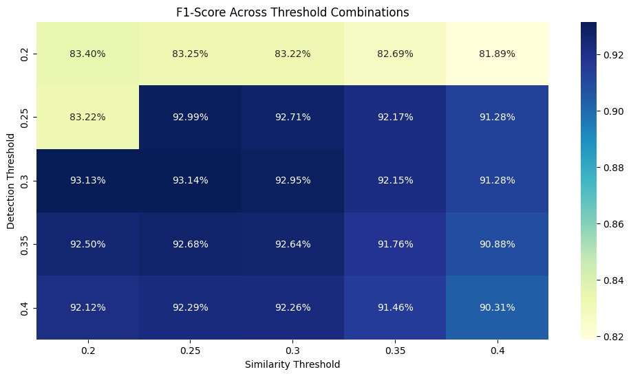

#### Antelope v2


**Result**:  
*Antelope v2* achieved the highest average F1 score across the evaluated thresholds, with a peak F1 score of **93.14%** at a **0.25 similarity threshold** and a **0.3 face detection threshold**, making it the most effective model among the three.

---

### Experiment 2: Assessing the Usefulness of Intra-Lecture Clustering

During each lecture, the TA captures 7–8 photos. We tested whether clustering detected faces within a lecture and applying majority voting (based on ground truth matching) would improve accuracy. This experiment used **Antelope v2**, based on its performance in Experiment 1.

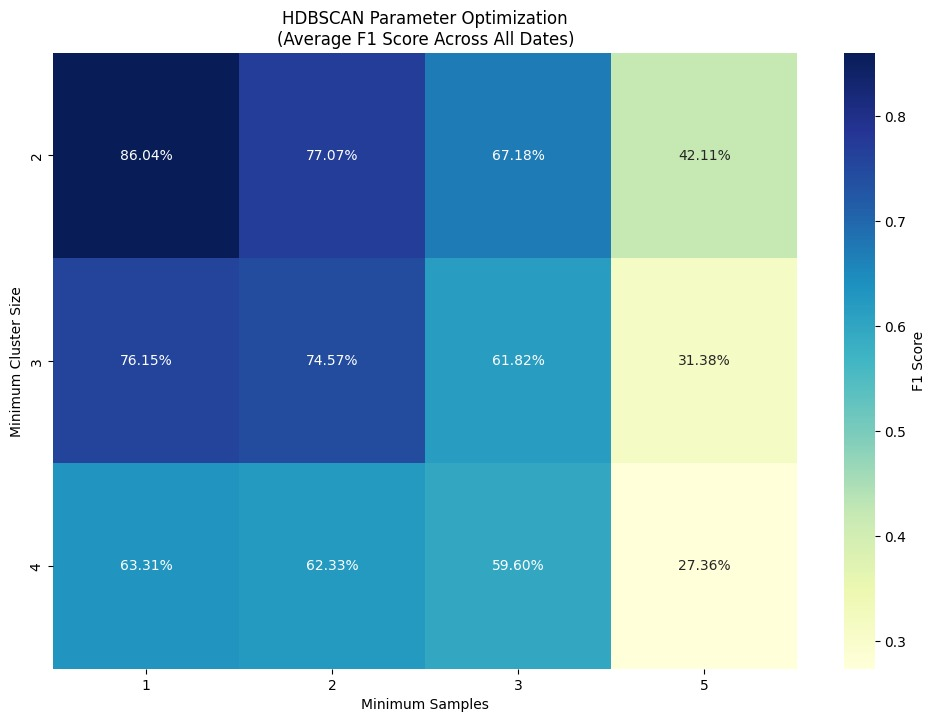

**Result**:  
Using intra-lecture clustering, the F1 score dropped from a maximum of **93%** to **86.04%**. Hence, we discarded this technique and opted to compare each face individually to the ground truth across all faces.


## Usage

### 1. **Login**
Upon accessing the server at `http://<your-ipv4>:<port>`, you will be greeted with the login screen.  


The default login credentials are:
- **Username**: `0`
- **Password**: `password`

This can be changed manually in the database.

---

### 2. **Upload Ground Truth**
> ⚠️ **Note**: For the current submission, the ground truth has already been added to the database. You can always click on `reset` button on the homepage and upload from your end if you want to test.

To upload the ground truth, follow these steps:
1. Prepare a **zip file** containing one image (not I-Card image) of each student in **.jpg**. The **filename** should be the student's **roll number** (e.g., `12345.jpg`).
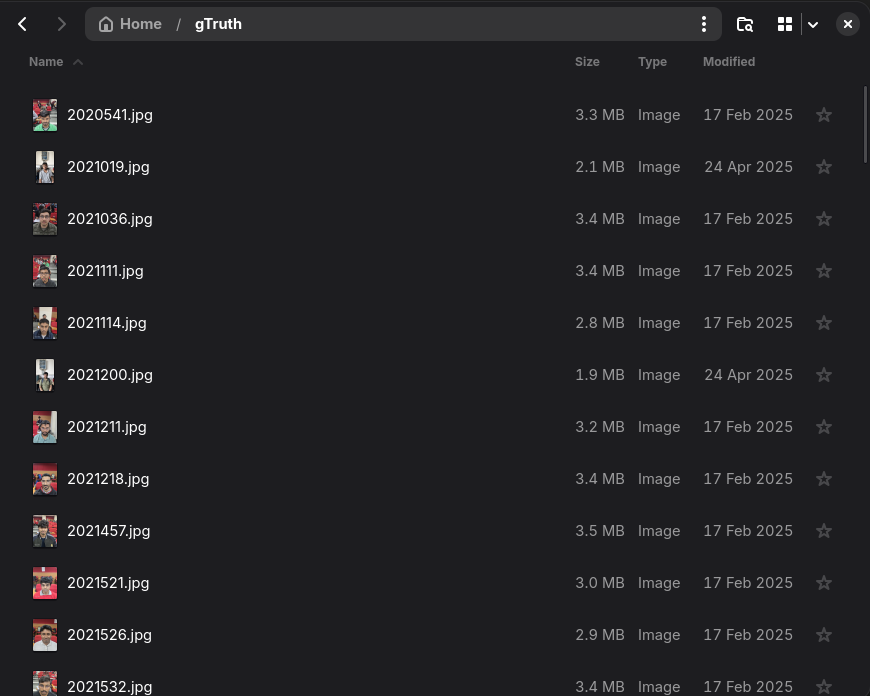
2. The images should **not be in any subdirectories**.
3. On the home page, if the ground truth has not yet been uploaded, you will be prompted to upload the zip file.  
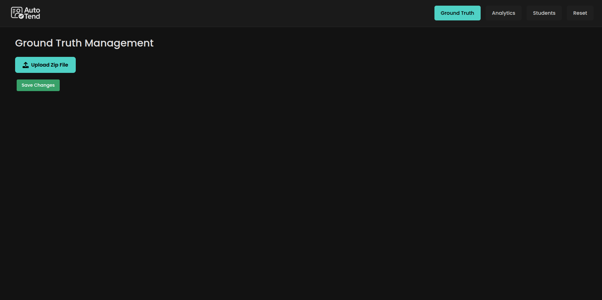
4. Select the zip file and click **Save Changes**.

> ⚠️ **Note**: During this time, to avoid data consistency issues, you won't be able to add a class or reset the program. The processing of the ground truth will take approximately 5 minutes. Once completed, the respective buttons will be re-enabled after you refresh the page.
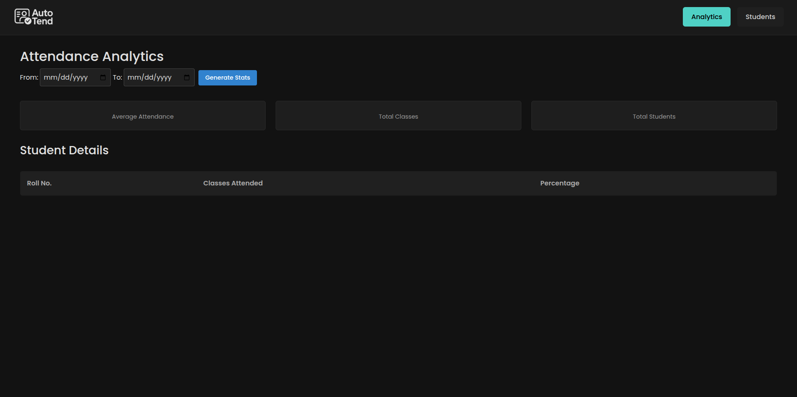
---

### 3. **Run Inference**

To run inference and add a new lecture, follow these steps:
1. On the home page, click **Add New Lecture**.
   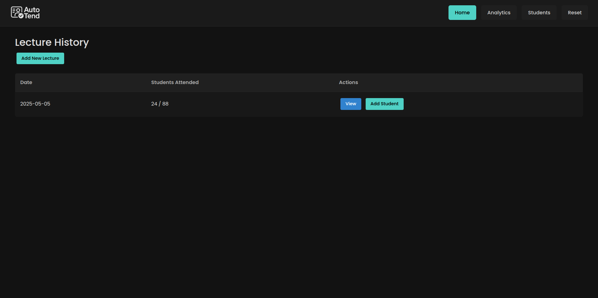

2. Click **Select Photos** and choose the photos to upload.
   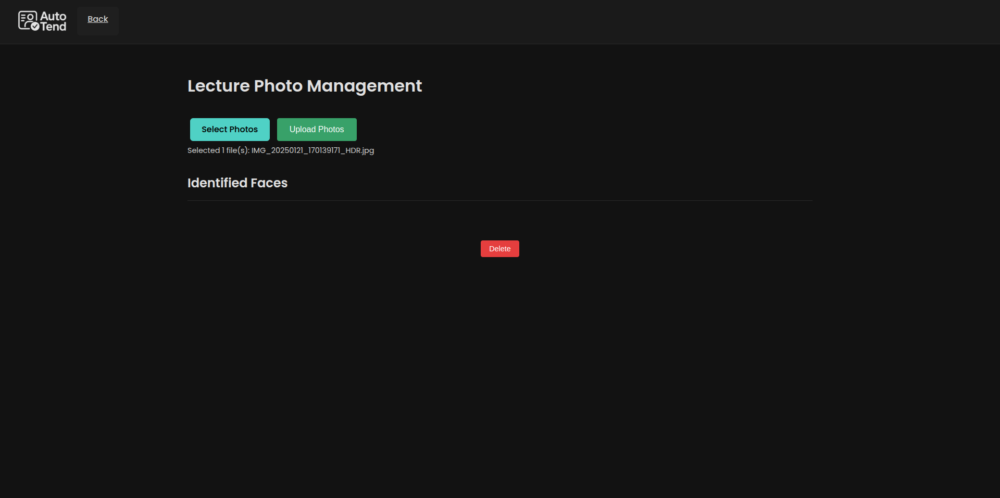

3. After selecting the photos, click **Upload Photos**.
   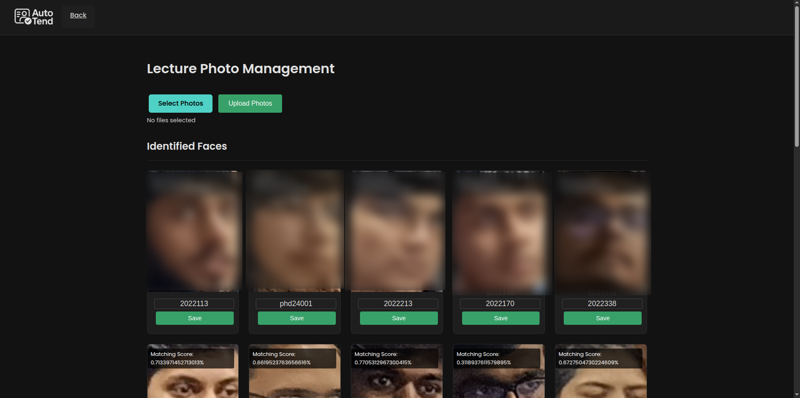

> ⏱️ **Note**: Processing **8 images** at once typically takes **less than a minute**.

> ⚠️ **Note**: Images should be in **.jpg** format.
---

### 4. **Using on Mobile**

To use the system on your mobile device:
1. Open the provided IPv4 address in **Safari**.

   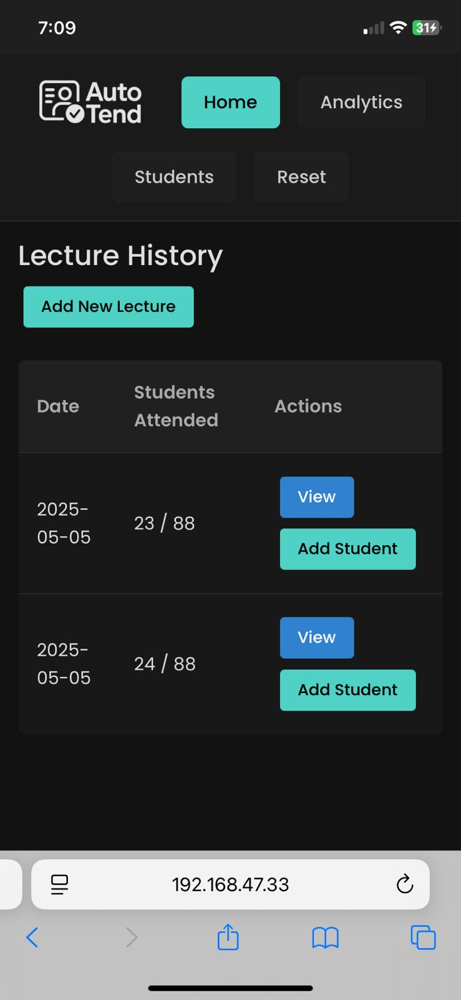

2. Tap the **Share** button and then select **Add to Home Screen**.

   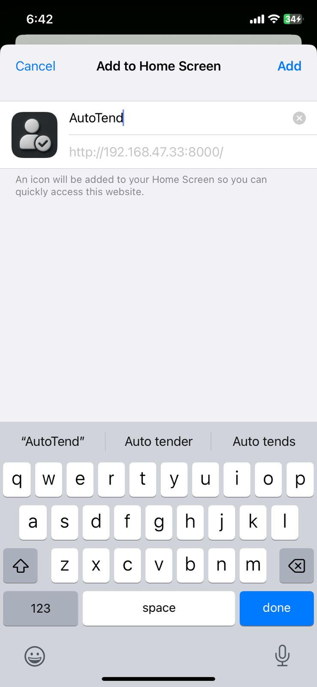


Now you can access the system like a native app on your mobile device.

   
   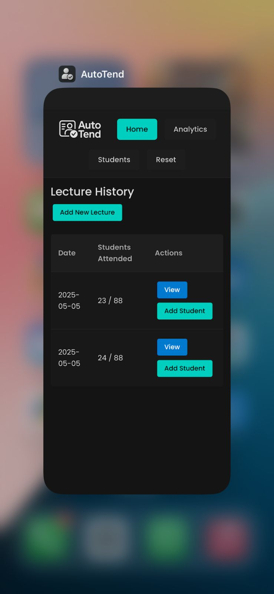
