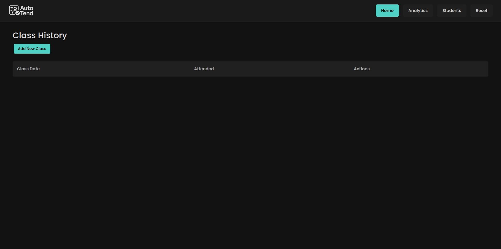
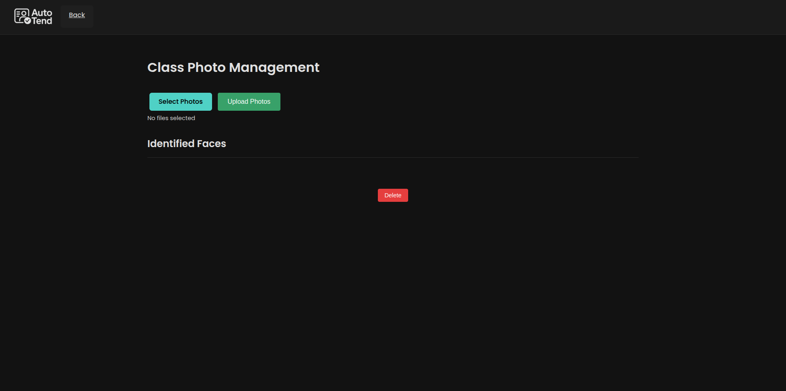
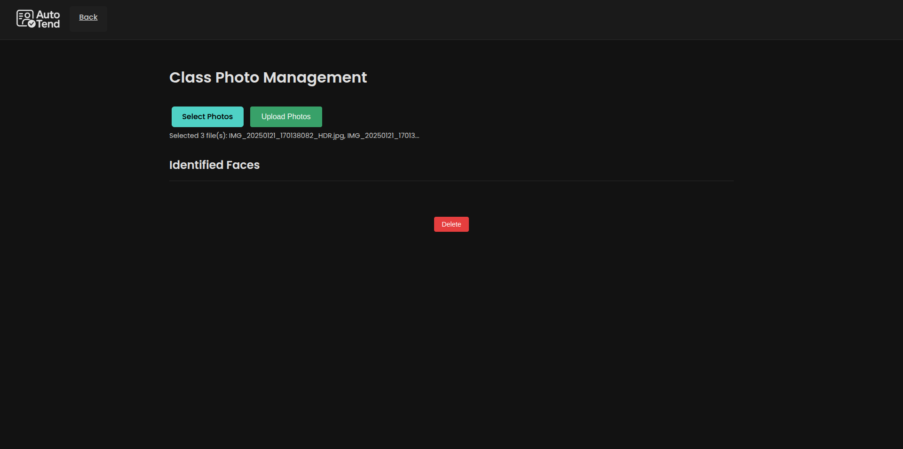
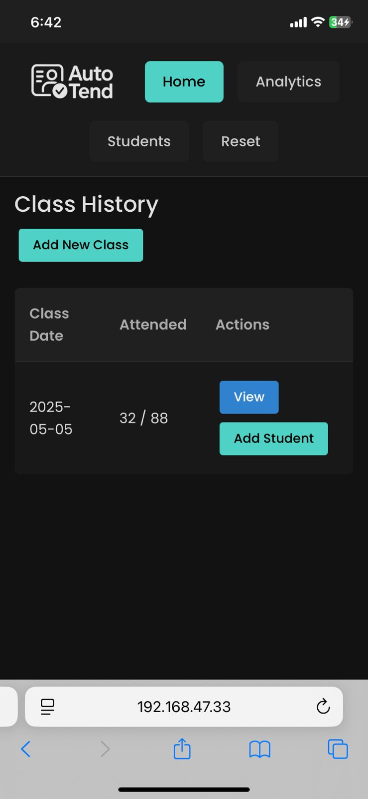
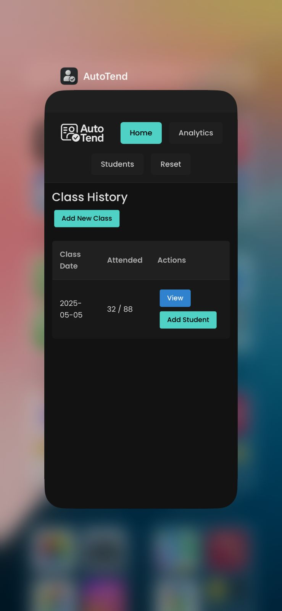

# Automatic Attendance System  
**Group 2**

## 🚀 Installation

1. Clone the repository and navigate to the project directory:
   ```bash
   cd AutoTend
   ```

2. Create and activate a virtual environment:
   ```bash
   python3.11 -m venv venv
   source venv/bin/activate
   ```

3. Install dependencies:
   ```bash
   pip install -r requirements.txt
   ```

4. Run the server using your machine’s **IPv4 address** (not `127.0.0.1` or `localhost`):
   ```bash
   python manage.py runserver <your-ipv4-address>:<port>
   ```


> ⚠️ **Note**: To get your IPv4 address in Python:
   ```python
   import socket
   s = socket.socket(socket.AF_INET, socket.SOCK_DGRAM)
   s.connect(("8.8.8.8", 80))
   print(s.getsockname()[0])
   s.close()
   ```

## Usage

### 1. **Login**
Upon accessing the server at `http://<your-ipv4>:<port>`, you will be greeted with the login screen.  


The default login credentials are:
- **Username**: `0`
- **Password**: `password`

This can be changed manually in the database.

---

### 2. **Upload Ground Truth**
> ⚠️ **Note**: For the current submission, the ground truth has already been added to the database. You can always reset the program and upload manually if you want to test.

To upload the ground truth, follow these steps:
1. Prepare a **zip file** containing one image (not I-Card image) of each student in **.jpg**. The **filename** should be the student's **roll number** (e.g., `12345.jpg`).

2. The images should **not be in any subdirectories**.
3. On the home page, if the ground truth has not yet been uploaded, you will be prompted to upload the zip file.  

4. Select the zip file and click **Save Changes**.

> ⚠️ **Note**: During this time, to avoid data consistency issues, you won't be able to add a class or reset the program at this time. The processing of the ground truth will take approximately 5 minutes. Once completed, the respective buttons will be re-enabled after you refresh the page.

---

### 3. **Run Inference**

To run inference and add a new class, follow these steps:
1. On the home page, click **Add New Class**.
   

2. Click **Select Photos** and choose the photos to upload.
   
   

3. After selecting the photos, click **Upload Photos**.
   

> ⏱️ **Note**: Processing **8 images** at once typically takes **less than a minute**.

> ⚠️ **Note**: Images should be in **.jpg** format.
---

### 4. **Using on Mobile**

To use the system on your mobile device:
1. Open the provided IPv4 address in **Safari**.

   

2. Tap the **Share** button and then select **Add to Home Screen**.
   

Now you can access the system like a native app on your mobile device.
   
   